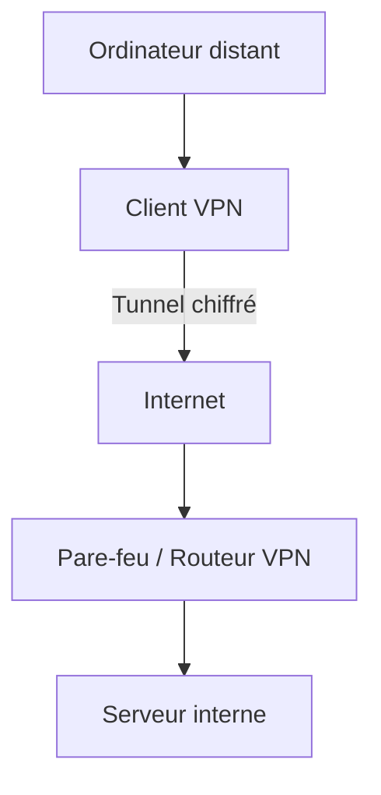
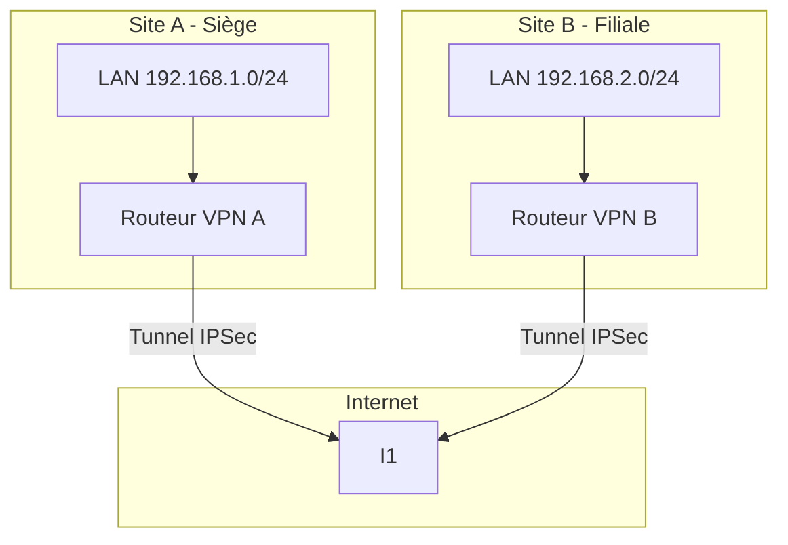
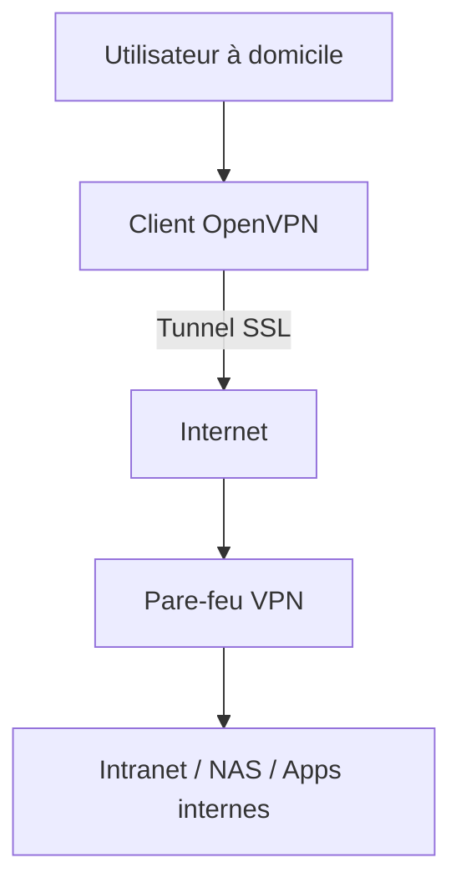

# 🔐 Fonctionnement d’un VPN & Utilité en Infrastructure Réseau

## 🧠 Qu’est-ce qu’un VPN (Virtual Private Network) ?

Un VPN est une **connexion chiffrée** entre deux points (par exemple, un poste client et un réseau privé d’entreprise), qui permet de **transporter des données en toute sécurité via un réseau public comme Internet**.

> 🎯 Objectif principal : créer un tunnel sécurisé entre deux entités réseau.

---

## 🧩 Composants principaux

- **Client VPN** : logiciel installé sur un poste.
- **Serveur VPN** : équipement ou service qui reçoit et déchiffre le trafic.
- **Tunnel VPN** : canal chiffré entre le client et le serveur.
- **Protocole VPN** : OpenVPN, IPSec, WireGuard...

---

## 🛡️ Utilité dans une infrastructure

### 🏢 Pour une entreprise :
- Accès sécurisé aux ressources internes depuis l'extérieur
- Connexion entre plusieurs sites (VPN site-à-site)
- Sécurisation des données en transit

### ☁️ Cloud / Hybride :
- Relier un réseau on-premise à un VPC cloud
- Accès sécurisé aux ressources cloud privées

---

## 📈 Exemple 1 : VPN client → entreprise

🔍 Flux :

1. Le client VPN s’authentifie.
1. Un tunnel chiffré est établi.
1. Le trafic est redirigé via le tunnel.
1. L’utilisateur accède au réseau interne.

## 📈 Exemple 2 : VPN site-à-site (entre 2 sites)

🔍 Flux :

1. Tunnel IPSec entre les routeurs.
1. Accès direct entre les réseaux internes.

## 🔒 Protocoles VPN courants

| Protocole     | Type           | Avantages                           |
|---------------|----------------|--------------------------------------|
| IPSec         | Site-to-site   | Standard, sécurisé, matériel supporté |
| OpenVPN       | Remote access  | Sécurisé, open-source, flexible      |
| WireGuard     | Remote access  | Léger, rapide, moderne               |
| SSL VPN       | Remote access  | Utilisable dans navigateur          |

---

## 🔧 Exemple : Télétravail

### 🔍 Fonctionnement :
- Authentification du client
- Tunnel SSL sécurisé
- Accès aux ressources internes

---

## ⚠️ Points de vigilance

- **Performance** : latence induite par le chiffrement.
- **Sécurité** : bien définir les règles d’accès.
- **Maintenance** : surveillance des certificats et connexions.

---

## 🛠️ Outils VPN

### Logiciels :
- pfSense / OPNsense
- OpenVPN Access Server
- StrongSwan (IPSec)
- WireGuard

### Cloud :
- AWS VPN Gateway
- Azure VPN Gateway
- GCP Cloud VPN

